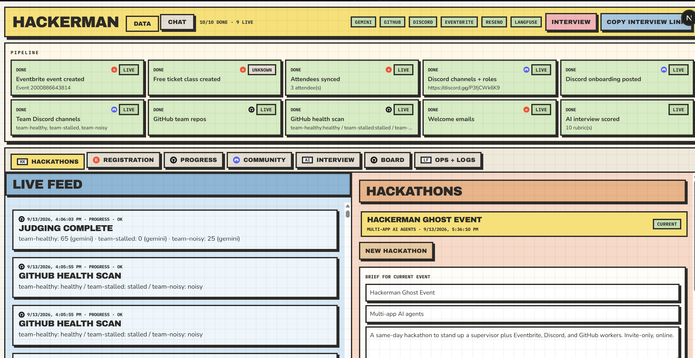
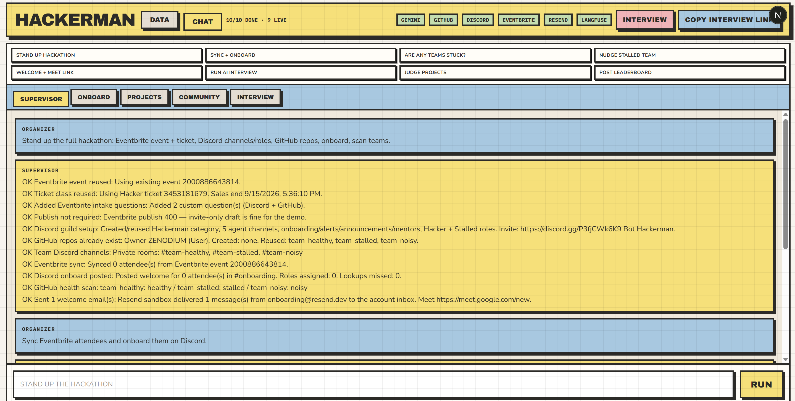
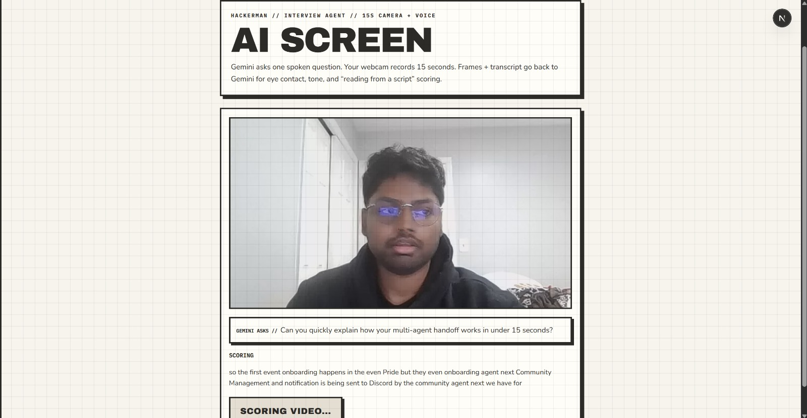

# Hackerman

A LangGraph **supervisor** that autonomously routes one organizer message to one of three domain agents. You do not pick Eventbrite vs GitHub vs Discord. The graph does.

Each worker is its own Gemini ReAct agent with live tools. It decides which API to call, writes to the app, then stops. If GitHub finds a stalled team, the graph **hands off** to Discord without another human prompt.

<p align="center">
  
</p>
<p align="center"><em>Dashboard (Data view) — live pipeline checklist, connection tags, and per-app panes.</em></p>

<p align="center">
  
</p>
<p align="center"><em>Chat — same supervisor box. Chips force a route; typed prompts go through Gemini.</em></p>

<p align="center">
  
</p>
<p align="center"><em>AI screening — 15s camera + voice. Separate graph node, not one of the three ops agents.</em></p>

```
you type (or hit a chip)
        │
        ▼
   SUPERVISOR          Gemini one-word route
   (LangGraph)         force → keywords → model
        │              pipeline | eventbrite | github | discord | interview | judge
        ▼
   ┌────────────┬────────────┬────────────┐
   │ ONBOARD    │ PROJECTS   │ COMMUNITY  │
   │ Eventbrite │ GitHub     │ Discord    │
   │ ReAct +    │ ReAct +    │ ReAct +    │
   │ 9 tools    │ 5 tools    │ 8 tools    │
   └────────────┴─────┬──────┴────────────┘
                      │ stalled?
                      └──► Discord nudge + Stalled role
```

## The interesting part: routing and autonomy

This is not a scripted “click step 1, then step 2” wizard. The Command Center is a thin UI over a supervisor that **manages three autonomous workers**.

**Supervisor (the router).** Reads the prompt. If you forced a chip, that wins. Else keywords. Else Gemini must reply with **one word**: `eventbrite`, `github`, `discord`, `interview`, `judge`, `pipeline`, or `finish`. Hop cap is 4. After GitHub, a graph edge sends stalled teams to Discord (`forceHandoff`). The supervisor does not call Eventbrite or Discord itself. It only chooses who acts.

**Onboard agent (Eventbrite).** Owns registration. Tools: create / reopen event, ticket, intake questions (Discord + GitHub usernames), publish, sync attendees, welcome mail, capacity, incomplete invitees. It chooses the subset (max 3 tools, never the same twice). You can say “sales ended” or “who is missing Discord” and it routes here and runs those tools.

**Projects agent (GitHub).** Owns progress. Tools: ensure `team-*` repos, health scan (healthy / stalled / noisy), open a stall issue, sponsor-stack scan, judge. Stall = no commit for `GITHUB_STALL_HOURS`. If any team is stalled, it returns `stalled[]` and the **graph**, not the organizer, wakes Community.

**Community agent (Discord).** Owns people. Tools: guild setup, team channels, onboard + Hacker role by exact username, nudge stalled, handoff from GitHub, leaderboard, timeline, matchmake, support. It does not re-scan GitHub (that loop hit recursion-limit 10). It trusts the handoff payload and posts / assigns.

**Why this is autonomy, not a workflow.**

- One sentence can hit a different agent every time. “Are teams stuck?” is GitHub. “Nudge them” is Discord. “Sync tickets” is Eventbrite. The same chat box, no mode switch required (chips are shortcuts, not the brain).
- Workers plan their own tool calls via `createReactAgent`. If Gemini fails, a keyword path still finishes so the demo cannot die mid-route.
- Cross-app management is a **graph edge**: GitHub diagnosis → Discord action. That is the multi-app requirement: the supervisor coordinates, workers execute, apps actually change.
- Interview and judge are extra nodes (15s camera screen; criticizer → promoter → score). They are not one of the three ops agents.

Next.js + LangGraph.js in one Node process. No FastAPI, no extra MCP servers.

Repo: [github.com/ZENODIUM/Hackerman](https://github.com/ZENODIUM/Hackerman)

## External apps

The brief asks for at least three. Live writes used in this project:

| App | What the agent does |
|---|---|
| Eventbrite | Create / reuse event, ticket class, Discord + GitHub intake questions, publish, sync attendees, reopen sales |
| Discord | Category, agent rooms, roles, team channels, onboard by username, stall nudge, leaderboard post |
| GitHub | Create `team-*` repos, health scan (healthy / stalled / noisy), stall issues, sponsor-stack scan, judge scores |

Also used, not counted as the core three:

- Gemini — routing, interview question + scoring, criticizer / promoter / judge
- Resend — welcome email + Meet link (sandbox; see drawbacks)
- Langfuse (optional) — supervisor route traces only on the free tier
- ngrok (optional) — public `/interview` URL for remote participants

## Features

**Command Center**

- Header toggle: Data or Chat (one at a time).
- Connection tags: Gemini, Eventbrite, Discord, GitHub, Resend, Langfuse.
- Pipeline checklist (10 rows) with `live` / `fixture` / `unknown`.
- Data tabs: Hackathons, Registration, Progress, Community, Interview, Board, Ops.
- Chat chips: stand up, sync + onboard, stuck?, nudge, welcome, interview, judge, post leaderboard.
- Chat tabs: Supervisor, Onboard, Projects, Community, Interview.
- Multi-hackathon records; each has its own Eventbrite event and dashboard slice.
- Copy interview link when `npm run tunnel` is up.

**Supervisor** (see routing section above)

- First stand-up asks name, topic, description, price, start, end (or `GENERIC` / `DEFAULTS`).
- Chip `force` overrides the model. Typed chat still goes through Gemini.

**Registration (Eventbrite + Resend)**

- Event from the brief; ticket sales run through event end (not event start).
- Reopen / extend an ended event instead of silently reusing it.
- Intake questions: exact Discord username and GitHub username.
- Sync attendees; strip Eventbrite `b'Name'` bytes-literal names.
- Flag low capacity; list incomplete invitees.
- Welcome email with Discord invite + Meet link.

**Progress (GitHub)**

- Ensure `team-healthy`, `team-stalled`, `team-noisy` (or `GITHUB_REPOS`).
- Health: stalled if no commit within `GITHUB_STALL_HOURS` (default 5).
- Noisy vs healthy from commit volume + README.
- Open stall issues; scan `package.json` + languages for sponsor stack.

**Community (Discord)**

- Hackerman category, per-agent rooms, onboarding / alerts / announcements / mentors.
- Hacker + Stalled roles (bot role must sit above them).
- Private team channels; onboard + role assign by username match.
- Nudge stalled teams; post timeline; matchmake solos; post leaderboard.
- `/status` is registered; Discord only hits it on a public Interactions URL.

**AI screening (Interview)**

- `/interview`: one spoken Gemini question, 15s webcam + mic.
- Scores frames + transcript: eye contact, tone, reading from a script.
- Advance / hold; clip + preview stored locally.
- Text-only score is marked `heuristic` if video or JSON parse fails.

**Judge**

- Criticizer → promoter → 0–100 GitHub judge per team.
- Scores on the Board tab; optional Discord #announcements post.

**Stand-up pipeline** (chip: STAND UP HACKATHON), after the brief:

1. Eventbrite event (or reopen sales)
2. Ticket class
3. Intake questions
4. Publish
5. Discord guild setup
6. GitHub team repos
7. Team Discord channels
8. Sync attendees
9. Discord onboard
10. GitHub health scan
11. Welcome emails

Interview is separate. The organizer or a remote friend opens `/interview`.

## Setup

```bash
npm install
copy .env.example .env.local   # Windows
# cp .env.example .env.local   # macOS / Linux
# fill keys in .env.local — never commit that file
npm run dev
```

- App: [http://localhost:3000](http://localhost:3000)
- Interview: [http://localhost:3000/interview](http://localhost:3000/interview)

```bash
npm run eval    # live GitHub health eval (needs GITHUB_TOKEN)
npm run e2e     # local /api/state + interview question
npm run tunnel  # ngrok http 3000 — keep npm run dev running
```

Send participants only `https://YOUR-NGROK-HOST/interview`. Free ngrok may show a Visit Site page once. The host changes if you restart the tunnel.

**Environment** — copy `.env.example` → `.env.local`. Empty keys keep that agent on fixtures.

| Variable | Needed for live | Notes |
|---|---|---|
| `GEMINI_API_KEY` | Routing, interview, judge | Default model `gemini-3.5-flash-lite` |
| `GITHUB_TOKEN` + `GITHUB_OWNER` | Repos + health | Classic PAT, parent `repo` scope. Owner must already exist |
| `GITHUB_REPOS` | Optional | Default `team-healthy,team-stalled,team-noisy` |
| `GITHUB_STALL_HOURS` | Optional | Default `5` |
| `DISCORD_BOT_TOKEN` + `DISCORD_GUILD_ID` | Channels, roles, posts | Members Intent on |
| `DISCORD_PUBLIC_KEY` | `/status` only | Plus a public Interactions URL |
| `EVENTBRITE_TOKEN` + `EVENTBRITE_ORGANIZATION_ID` | Create / sync events | Event id optional; the agent can create one |
| `RESEND_API_KEY` | Welcome email | Sandbox from-address only delivers to `RESEND_TEST_TO` |
| `LANGFUSE_*` | Optional | Supervisor traces only on the free tier |

Discord channel / role IDs in `.env.example` are optional. The bot creates them and stores IDs in `data/store.json`.

Do not commit `.env.local`, `data/store.json`, or interview clips. The redacted build journal in `agent-logs/` is committed.

**Discord bot (manual):** Developer Portal → Members Intent on. Invite scope `bot`. Permissions: Manage Channels, Manage Roles, Send Messages, View Channels, Read Message History. Put the bot role above Hacker and Stalled.

**GitHub PAT:** Classic token, parent `repo` scope. The API cannot create a new organization.

**Remote participant:** they do not need your Wi‑Fi for Eventbrite, Discord, or GitHub. Register with exact Discord + GitHub usernames, join the invite, then you hit SYNC + ONBOARD. Forward the Meet / Discord links yourself while Resend is in sandbox. Same LAN is only required if they must open the app without a tunnel.

## Reliability testing

Two layers: **automated scripts** that can fail CI, and **manual agent runs** against live Eventbrite / Discord / GitHub. **Langfuse** is the observability backend for supervisor routing.

**Automated**

- `npm run eval` — GitHub health classifier vs `eval/fixtures.json` (`team-healthy`, `team-stalled`, `team-noisy`). Hits the live GitHub API when `GITHUB_TOKEN` is set. Last live run: **3 / 3**. Writes `eval/results.json`.
- `npm run e2e` — against a running `npm run dev`: `GET /api/state`, interview question, `POST /api/chat` stand-up (`force: pipeline`), stuck/handoff (`force: github`), state-after, traces. Exits non-zero if any step is 400+ or returns `error`.
- Checklist + header tags are derived from store + connection keys (`live` / `fixture` / `unknown`). A green row means that step left a real activity, not just a label.

```bash
npm run eval
npm run e2e    # needs the app on :3000
```

**Manual agent tests** (organizer + one remote friend)

- STAND UP — Eventbrite event/ticket/intake, Discord category/roles/channels, GitHub `team-*` repos. Confirm checklist 10/10 and `live` badges.
- Real tickets — two Eventbrite registrations with exact Discord + GitHub usernames. SYNC + ONBOARD. Confirm attendees (names unwrapped), Hacker role if they already joined the guild.
- GitHub → Discord — ARE ANY TEAMS STUCK? then NUDGE. `team-stalled` must classify stalled; Discord #alerts + Stalled role.
- Interview — `/interview` 15s camera. Rubric `scoredBy: gemini` (not heuristic) on the Interview tab.
- JUDGE + POST LEADERBOARD — Board scores, then #announcements.
- Fail paths we actually hit: Eventbrite `b'Name'` bytes (now unwrapped), sales ending at event start (now sales through event end), Discord tool recursion-limit 10 (Discord no longer re-calls `check_github_health`).

Live event used for this: Eventbrite `2000886643814`, Discord guild, GitHub under `ZENODIUM`.

**Observability (Langfuse + local)**

- **Langfuse** (`LANGFUSE_PUBLIC_KEY` / `SECRET` / `LANGFUSE_BASE_URL`) records **supervisor routing traces** — which one-word route Gemini chose and the prompt. Free-tier quota: workers and tool spans stay off Langfuse on purpose.
- Every node still writes a redacted row to `data/agent-runs.jsonl` and `data/traces.jsonl`. The Ops tab reads those. `npm run e2e` asserts traces exist and reports `langfuse: true` when keys are present.
- `agent-logs/session.md` + `session.jsonl` are the Cursor build journal (committed, secrets redacted).

## Demo video

Two minutes or less. Link:

_Add the unlisted video URL here after upload._

Suggested beat sheet: problem → live checklist → Chat chips / stand-up log → Eventbrite attendee + Discord role → Interview rubric → Board + Discord leaderboard → `eval` 3/3.

## Known drawbacks

- Resend sandbox (`onboarding@resend.dev`) only delivers to the account inbox (`RESEND_TEST_TO`). Participants do not get mail until a domain is verified.
- State is a local `data/store.json`. Restarting on another machine, or a new deploy, does not share attendees, clips, or Discord IDs.
- Command Center has no auth. Anyone who can reach the host can run chips.
- Interview clips live on disk under `data/interviews/`. They are gitignored and not on object storage.
- Discord username lookup can miss (search vs exact username / global name / nick). We still post to a channel and log the miss.
- `/status` never fires against localhost. Discord requires a public Interactions Endpoint URL.
- Free ngrok: changing URL, Visit Site interstitial, not a stable participant link.
- Gemini Flash-Lite is cheap and can return non-JSON; interview then shows `scoredBy: heuristic`.
- Langfuse free tier is supervisor-only. Worker / tool spans stay local.
- ReAct can fail; workers fall back to keywords. Discord tools are capped to avoid recursion-limit 10.
- Eventbrite `profile.name` sometimes arrives as Python bytes literals (`b'Jane' b'Doe'`). We unwrap on sync; the API still sends that form.
- GitHub health eval is three fixture repos, not a full multi-app eval. `team-stalled` can 409 on an empty repo and still classify as stalled.
- The agent cannot create a new GitHub organization.
- Eventbrite publish can 400 on some draft/invite states; stand-up continues.
- Empty live Eventbrite sync does not wipe prior attendees (demo-safe, not a strict source of truth).

## Future steps

Items below are intentionally out of this build. Most are blocked by paid tiers, verified domains, or always-on hosting cost — not by missing code paths.

**Cost / account blockers**

- Resend: verify a domain and leave the sandbox so every attendee gets the welcome + Meet mail, not just `RESEND_TEST_TO`.
- Cloud database (Postgres / hosted SQLite equivalent): replace `data/store.json` so multiple organizers, deploys, and restarts share one source of truth. Local disk was free for the hackathon; a hosted DB is not.
- Object storage (S3 / R2) for interview webm/mp4 instead of gitignored local files.
- Always-on public host + custom domain so Discord Interactions and `/interview` stay on one HTTPS URL. Free ngrok is not that.
- Langfuse paid (or self-host): export worker and tool spans, not only supervisor routes.
- A stronger Gemini model for interview + judge if Flash-Lite JSON / scoring is not enough. Flash-Lite was chosen to stay on the free / low-cost quota.
- Eventbrite org limits and paid listing features if volume grows past a single demo event.
- Luma as a second registration provider (same create / ticket / intake / sync tools). Luma’s usable API and higher event volume sit on a paid tier; Eventbrite stays the free-path default until that cost is covered.

**Product improvements (after the cost items)**

- Organizer auth and per-hackathon access control.
- Persist chat threads next to the activity log.
- Deeper Discord inbound (slash + gateway) once the public URL is stable.
- Broader evals: Eventbrite sync, Discord role assign, interview rubric fixtures — not only GitHub health.
- Dedup Eventbrite orders; treat empty live sync as empty, not “keep last demo rows.”
- Team matching from real GitHub usernames on tickets, not only seed `team-*` repos.

## Stack

- Next.js 16 (App Router) + React 19 + TypeScript + Tailwind
- LangGraph.js supervisor + `createReactAgent` workers
- Local JSON store in `data/` (gitignored)
- Node runtime only

## Layout

```
src/app/                  pages + API routes
src/components/           Command Center + brand marks
src/lib/graph.ts          LangGraph supervisor
src/lib/pipeline.ts       deterministic stand-up
src/lib/tools.ts          ReAct tools
src/lib/agents/           Eventbrite, Discord, GitHub, Resend, interview, judge
src/lib/store.ts          multi-hackathon JSON store
eval/                     GitHub health eval
agent-logs/               Cursor-agent build journal (committed, secrets redacted)
screenshots/              dashboard, chat, AI screening
```


